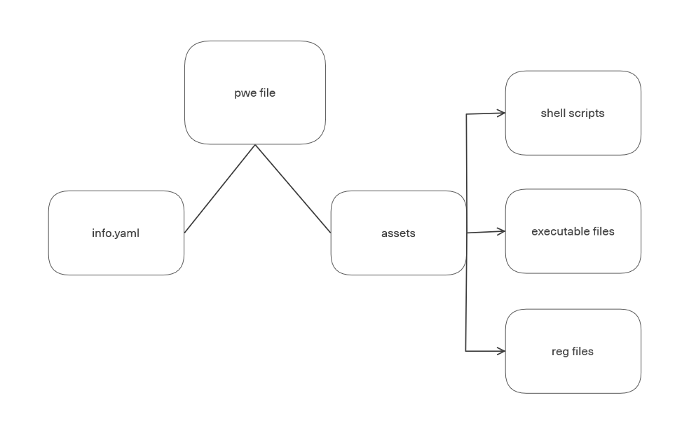

# PWE FILE INTRO

The file with the end a .pwe is a file that stores an info file.yaml and the assets folder where the assets are located. the file itself is a regular zip archive with a password, the key to which is the string "{creator__name}-{version}-{homeurl}-pwepass", the fields creator_name, version and home_url are parsed with info.yaml, the string itself is encoded in base64, this is the key to the pwe file.

